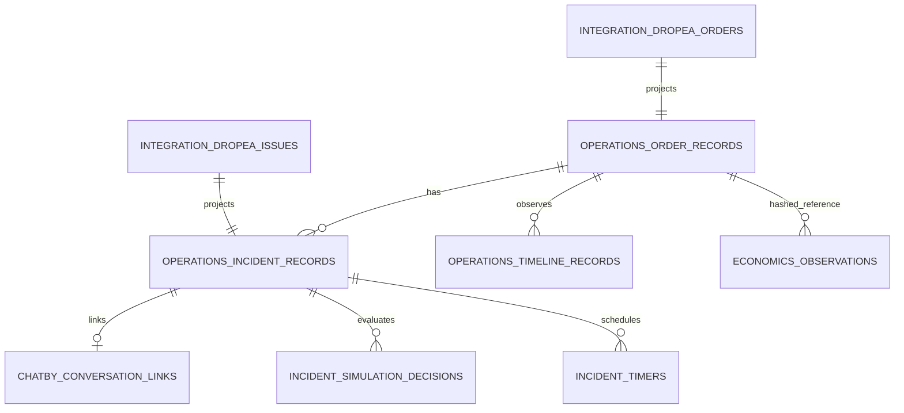

# Contrato real de datos — Operations Center e incidencias

Estado: diagnóstico Fase 0; no implica migración ni acción externa.

Fuente de verdad de este documento: esquema PostgreSQL desplegado, vistas de lectura, adaptador Dropea V2 y conteos agregados del 2026-08-09.

## Principios

1. Un campo solo es canónico si existe, tiene semántica definida y trazabilidad.
2. Estado actual y transición histórica son conceptos distintos.
3. `FOUND` significa enlace conversacional encontrado; no significa respuesta válida.
4. Una interpretación no es un mapping de transportista.
5. La ausencia de una entidad o dato se publica como `NOT_MODELED`/`UNKNOWN`, nunca se infiere.
6. Los datos de cliente y payloads permanecen enmascarados.
7. Toda consulta de este contrato es de solo lectura.

## Topología activa

La relación entre mirrors Dropea y read models se mantiene por identificadores de texto y por el proyector. El catálogo de restricciones no muestra una FK entre el pedido y la incidencia Dropea; la integridad de esa unión no debe darse por garantizada sin una validación explícita.

## Sistemas de registro

| Dominio | Sistema de registro observado | Modelo de lectura operativo | Estado |
|---|---|---|---|
| Pedidos Dropea | `integration.dropea_orders` | `read_models.operations_order_records/context` | ACTIVO, 961 |
| Incidencias Dropea | `integration.dropea_issues` | `read_models.operations_incident_records/context` | ACTIVO, 327 |
| Conversación Chatby | enlace en `operations.chatby_conversation_links` | contexto de incidencia | PARCIAL, 18 enlaces; 0 eventos |
| Decisiones | `operations.incident_simulation_decisions` | contexto/timeline | SIMULACIÓN, 37 |
| Temporizadores | `operations.incident_timers` | contexto/timeline | PARCIAL, 18; cierre no efectivo |
| Historial pedido | `read_models.operations_timeline_records` | `order_state_history` | INSUFICIENTE: una observación/pedido |
| Historial incidencia | `read_models.operations_timeline_records` | `issue_state_history` | ACTIVO, observaciones de estado |
| Economía | `economics.observations` | resumen financiero ad hoc | PARCIAL, sin ledger canónico |
| Políticas | `configuration.policies/policy_versions` | version string en decisiones | NO POBLADO |
| Feedback/revisión | `decisions.*` | no conectado al panel | NO POBLADO |

## Definiciones canónicas de alcance

### Pedido actual

Un pedido operativo actual es una fila de `read_models.operations_order_context`. Su estado actual procede de `integration.dropea_orders.lifecycle_status`. No representa el historial completo.

### Pedido abierto

Conjunto técnico actual: `PENDING`, `CONFIRMED`, `PROCESSING`, `SHIPPING`, `INCIDENCE`. La etiqueta “en el aire” no forma parte del contrato y debe eliminarse o definirse explícitamente.

### Pedido enviado

Requiere un hito histórico verificable (`shipped_at` o evento equivalente). Ese hito no está modelado en los datos actuales. Mientras siga ausente, el valor canónico es `NOT_AVAILABLE`, no el recuento del estado actual `SHIPPING`.

### Pedido entregado

Hito verificable: `integration.dropea_orders.delivered_at_utc IS NOT NULL`. El estado actual `DELIVERED/FINISHED` puede mostrarse aparte.

### Incidencia activa pendiente

`read_models.operations_incident_records.status='PENDING' AND is_active=true`. En la medición: 18. Las tarjetas que describan esa cola deben usar exactamente este mismo predicado.

### Incidencia accionable

`actionable=true`. Es una dimensión distinta de “pendiente”. En la medición: 0. No debe etiquetarse simplemente como “pendiente”.

### Conversación encontrada

`conversation_status='FOUND'`: existe enlace hash/evidencia. No acredita mensaje entrante ni vigencia.

### Respuesta válida

Requiere evidencia de un mensaje entrante del mismo cliente, posterior a la versión/creación de la incidencia y no descartado como obsoleto. En la medición: 0. El estado actual no puede derivarse solo de `FOUND`.

### Frescura compuesta de incidencia

Debe separar, como mínimo:

- frescura del pedido/incidencia Dropea;
- frescura de la conversación Chatby;
- última sincronización correcta de cada fuente.

Una decisión dependiente de ambas solo puede ser fresca si ambas fuentes requeridas lo son.

### Temporizador efectivo

`effective_status = EXPIRED` cuando el estado persistido sea `ACTIVE` y `due_at <= now()`. Este cálculo es solo lectura y no autoriza ningún envío ni mutación.

### Confianza

- `interpretation_confidence`: confianza en la interpretación de conversación.
- `mapping_status`: estado de gobernanza del código de transportista.

No existe una “confianza de mapping 1.0” en el contrato actual; no deben presentarse como una sola métrica.

### Importe comercial y economía

`total_amount` es el valor comercial observado del pedido. No demuestra costes, margen, devolución, coste logístico, conciliación ni gasto de IA. Hasta disponer de un ledger reconciliado, la cobertura económica debe declararse parcial.

## Historial y cardinalidad

- Un pedido puede tener cero o más incidencias.
- Una incidencia puede tener cero o un enlace conversacional vigente y múltiples decisiones/temporizadores históricos.
- Un pedido debería poder tener múltiples envíos, pero `shipment` no existe como entidad independiente; hoy solo hay campos embebidos de carrier/tracking.
- `order_state_history` no es todavía un historial de transiciones: proyecta observaciones de timeline y contiene una sola fila por pedido en la muestra.

## Integraciones externas verificadas

| Fuente | Lectura verificada en adaptador | Uso permitido en esta fase |
|---|---|---|
| Dropea V2 | listado/detalle de pedidos e incidencias | Solo lectura |
| Chatby | endpoint de suscriptores configurado | Bloqueado por 401; no usar como dato vigente |
| GLS | códigos observados dentro de incidencias Dropea | Solo mappings verificados; no acciones |
| TIPSA | no aplicable | Fuera de alcance |

No se documentan endpoints no observados ni se inventan contratos de escritura.

## Vacíos bloqueantes para las siguientes fases

1. Evento/hito verificable de envío.
2. Definición única de alcance para KPIs y listas.
3. Ingesta Chatby válida y eventos posteriores a incidencia.
4. Mapping gobernado para 216 incidencias desconocidas.
5. Estado efectivo de temporizador.
6. Huella y diff de entrada para cada recálculo de decisión.
7. Políticas versionadas persistidas.
8. Ledger económico por pedido y reglas de conciliación.
9. Resolución explícita del umbral Dropea 600 s frente a 900 s.
