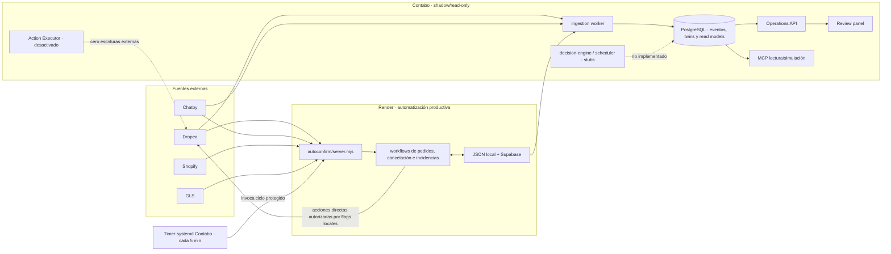

# Arquitectura actual de gestión de incidencias

**Fase:** 0 — auditoría

**Corte de evidencia:** 2026-08-19

**Alcance:** repositorio completo, ramas desplegadas, configuración efectiva y comprobaciones no invasivas de Render y Contabo

**Cambios productivos durante la auditoría:** ninguno

## 1. Resumen ejecutivo

Suleia no ejecuta hoy una única arquitectura de incidencias. Existen dos planos con responsabilidades y ciclos de vida distintos:

1. **Render es el plano productivo de automatización.** El proceso `autoconfirm/server.mjs` lee Dropea, Chatby, Shopify y GLS, mantiene estado local/Supabase y puede confirmar o cancelar pedidos mediante llamadas directas a Dropea V2. También calcula recomendaciones de incidencias, aunque la ruta V2 vigente mantiene su resolución en solo lectura.
2. **Contabo es el plano shadow/read-only y de Operations Center.** Replica fuentes, proyecta PostgreSQL, muestra pedidos e incidencias y guarda feedback interno. Sus escrituras externas están desactivadas; el servicio de ejecución es un stub y los contenedores nominales de decisiones y scheduler aún no implementan esos procesos.

El repositorio ya contiene la mayoría de los conceptos solicitados —Event Store, Digital Twin, reglas, conflictos, gobernanza, simulación, idempotencia, feedback y read models—, pero están **fragmentados, duplicados o sin conectar al runtime**. La evolución recomendada es consolidarlos, no crear una tercera plataforma.

El resultado de esta Fase 0 es documental. No se han cambiado reglas, esquemas, despliegues, variables, pedidos, mensajes ni incidencias.

## 2. Versiones y procedencia verificadas

| Elemento | Revisión o estado verificado | Interpretación |
|---|---|---|
| Rama productiva Render | `origin/main@9569b01cc9af936bcf919dee5fe9f33d7151057d` | Revisión `Live` del servicio `suleia-autoconfirm` |
| Rama de plataforma Contabo | `origin/deploy/contabo-operations-live@e17141edc87710c21dcf3c2292816a3f15218f12` | Revisión de la imagen activa, corroborada por etiqueta OCI e inventario MCP interno |
| Fuente enlazada en el host Contabo | `/opt/suleia-operations -> 47add8f9efc692461520a0d3fb50caa9cde764ff` | Puntero de release desactualizado; no representa el código efectivo del contenedor |
| Base común de ramas | `08a0aaa8` | `main` conserva 11 commits exclusivos y `deploy` 192; no son intercambiables |
| Diferencia `47add8f9..e17141e` | 1 commit, 5 archivos de presentación | Corrige referencias visuales y textos Chatby duplicados; no cambia el backend de decisión |

La etiqueta OCI y el inventario obtenido dentro del contenedor son la evidencia autoritativa del código ejecutado en Contabo. El symlink del host constituye un problema de trazabilidad de release que debe corregirse antes de cualquier promoción, pero no implica que el contenedor esté ejecutando `47add8f9`.

La rama `deploy/contabo-operations-live` no contiene automáticamente todos los cambios posteriores de `main`. Cualquier implementación futura necesita primero una base de integración reproducible y no un merge mecánico de estos dos historiales divergentes.

## 3. Topología real



Esta topología evidencia dos fuentes de estado y dos familias de reglas. El Event Store de Contabo aún no gobierna las decisiones productivas de Render.

## 4. Plano productivo de Render

Las rutas de esta sección se verificaron en el snapshot separado `main@9569b01`, que es el árbol autoritativo de Render. Los clientes Dropea V2 de pedidos/acciones y el timer VPS reciente no existen en el HEAD documental `deploy@e17141e`; se citan como evidencia cross-branch y deberán entrar mediante la Fase 0.5, no asumirse presentes en esta rama.

### 4.1 Entrada y responsabilidades

El `package.json` raíz inicia `node autoconfirm/server.mjs`. El proceso reúne en un mismo runtime:

- API y dashboard;
- webhooks;
- polling y sincronización;
- clasificación determinista y, opcionalmente, asistencia OpenAI;
- confirmación de pedidos;
- cancelación de pedidos sin respuesta;
- lectura y recomendación de incidencias;
- temporizadores internos y endpoints cron;
- persistencia JSON/Supabase.

Las piezas principales son:

| Área | Implementación actual |
|---|---|
| Confirmación y clasificación | `autoconfirm/src/workflows/orders.mjs` |
| Cancelación sin respuesta | `autoconfirm/src/workflows/unanswered-cancellations.mjs` |
| Incidencias | `autoconfirm/src/workflows/incidents.mjs` |
| Vista operativa legado | `autoconfirm/src/workflows/operational-orders.mjs` |
| Pedidos y acciones Dropea V2 | `autoconfirm/src/clients/dropea-v2-orders.mjs`, `dropea-v2-order-actions.mjs` |
| Incidencias Dropea V2 | `autoconfirm/src/clients/dropea-v2-incidents.mjs` |
| GLS | `autoconfirm/src/clients/gls.mjs` |
| Persistencia | `autoconfirm/src/storage.mjs`, `autoconfirm/src/db/supabase-store.mjs` |
| Configuración | `autoconfirm/src/config.mjs`, variables de entorno y `data/stores.json` local |

### 4.2 Acciones externas

La confirmación y cancelación V2 usan una clave idempotente estable `suleia-{action}-{orderId}` y validan host, scopes y expiración de credenciales. Las plantillas Chatby disponen de claim persistente en Supabase y claim en memoria.

Sin embargo, las mutaciones productivas salen directamente de los workflows hacia los clientes Dropea. No atraviesan el `Policy Gate` ni el `Action Executor` de `platform-core`. La idempotencia no cubre de forma demostrada caídas después de un commit remoto, timeouts ambiguos, concurrencia multiproceso o reconciliación tras reinicio.

La resolución de incidencias por Dropea V2 está actualmente bloqueada en solo lectura. El workflow puede construir recomendaciones, pero la ruta vigente no ejecuta una solución de incidencia ni envía mensajes reales.

### 4.3 Planificación

La planificación está distribuida entre:

- intervalos internos de `autoconfirm/server.mjs`;
- endpoints `/api/cron/*`;
- el blueprint `autoconfirm/render.yaml`;
- un timer systemd en Contabo (`infrastructure/vps/suleia-render-automation.timer` en `main` y en el host) que invoca el ciclo Render cada cinco minutos.

La cola interna serializa trabajos dentro de un proceso y `flock` protege el invocador VPS, pero no existe un lock distribuido común para todos los disparadores. Tampoco hay un manifiesto único que demuestre cuál de los dos blueprints Render gobierna la producción.

### 4.4 Estado observado

La consulta no invasiva de health de 2026-08-19 mostró:

- servicio operativo y no suspendido;
- polling y automatización recientes, sin error reportado;
- confirmación y cancelación declaradas `enabled/ready`;
- acciones Dropea y Supabase declaradas listas.

Este health demuestra disponibilidad del proceso, no la corrección semántica de cada decisión ni la ausencia de carreras entre disparadores.

## 5. Plano Contabo shadow/read-only

### 5.1 Servicios desplegados

`infrastructure/docker/compose.yaml` declara:

- reverse proxy y MCP edge;
- Operations API (`apps/api/server.mjs`);
- MCP (`packages/suleia-operations-mcp`);
- ingestion worker (`services/shadow-readonly-worker.mjs`);
- decision engine y scheduler nominales (`services/process-runner.mjs`);
- review panel;
- PostgreSQL, Keycloak, backup y monitorización.

La imagen activa opera con:

```text
RUN_MODE=SHADOW_READ_ONLY
SIMULATION_ONLY=true
PRODUCTION_WRITES_ENABLED=false
ACTION_EXECUTOR_ENABLED=false
```

Solo el ingestion worker realiza trabajo funcional de dominio. En cada ciclo replica el legado, lee Dropea V2 y Chatby, proyecta señales y genera simulaciones de incidencias. Los procesos `decision-engine` y `scheduler` responden `NOT_IMPLEMENTED`; el timer engine figura como no desplegado. `services/action-executor.mjs` está deliberadamente deshabilitado y aborta cualquier intento de ejecución.

Estos flags no equivalen a least privilege de credenciales: el compose inyecta `SUPABASE_SERVICE_ROLE_KEY` y el source shadow lo usa como token de lectura. Ese rol posee capacidad de escritura aunque el código observado haga GET. Tampoco queda acreditado en repositorio el alcance exacto del `CHATBY_TOKEN`. Por tanto, el cero-write actual depende de código/flags y no de una identidad técnicamente read-only; debe corregirse antes de considerar el shadow como control fuerte.

### 5.2 API, panel y MCP

Operations Center obtiene sus vistas de PostgreSQL. La API es de lectura salvo el endpoint autenticado de feedback, cuya escritura es interna y no produce acciones externas. El acceso privado de Operations puede descifrar nombre, teléfono y mensajes; MCP permanece enmascarado y no puede acceder a esas columnas privadas.

El MCP activo expone herramientas de lectura/simulación y acreditó durante la auditoría:

- PostgreSQL 17.5;
- 21 migraciones aplicadas;
- 136 objetos y 31 read models;
- conectores Dropea y Chatby de lectura habilitados;
- escrituras externas deshabilitadas.

### 5.3 Frescura observada

El corte de auditoría devolvió estado global `STALE`:

- Chatby: `FRESH`;
- eventos fuente de pedidos/incidencias Dropea: `STALE` por superar el umbral de 600 segundos;
- Event Store, Digital Twin y read model: `UNKNOWN` porque sus timestamps o la semántica del umbral no permiten acreditar frescura de forma independiente.

Además, la lista de incidencias etiquetaba su metadato como `FRESH` mientras el estado global y la fuente Dropea eran `STALE`. Esa contradicción confirma que la frescura visual no debe utilizarse aún como autorización operativa.

En ese mismo corte había una incidencia activa `PENDING` y 256 findings operativos abiertos: 236 de prioridad alta y 20 media. Son señales de calidad/revisión, no acciones productivas.

## 6. Persistencia y fuentes de verdad

### 6.1 Fuentes externas

| Dato | Fuente autoritativa actual | Matiz |
|---|---|---|
| Estado y acción de pedido | Dropea Public API V2 | La caché local sirve para workflow/auditoría, no para contradecir silenciosamente el remoto |
| Intención del cliente | Mensajes entrantes Chatby ligados al pedido actual y posteriores al inicio aplicable | Labels y campos de suscriptor son evidencia secundaria |
| Pago | Shopify | Debe compararse contra estados exactos, no por coincidencia parcial de texto |
| Transporte/incidencia | Incidencia vigente Dropea/GLS | El historial no equivale al estado vigente |
| Estado operativo local | Supabase/JSON en Render; PostgreSQL en Contabo | Hoy son memorias separadas, no una única autoridad |

### 6.2 PostgreSQL de plataforma

Las migraciones `001`–`021` ya proporcionan una base considerable:

- `002_platform_schema.sql`: raw/core, Event Store append-only, decisiones, evidencia, confidence breakdown, revisiones, políticas, jobs, idempotencia y auditoría;
- `003`–`006`: vistas MCP, completitud, réplica shadow y Operations Center;
- `008`–`010`: incidencias, historial Dropea y catálogo gobernado de códigos;
- `013`–`018`: Chatby, identidad, timeline, reconciliación y freshness;
- `019` y `021`: contexto privado cifrado para API autenticada;
- `020`: feedback de recomendaciones.

El catálogo de códigos conserva `UNKNOWN/UNMAPPED`, revisión humana y `automation_allowed=false`, una base adecuada que debe reutilizarse.

También existen solapamientos: varias migraciones incorporan segundos modelos de twins, snapshots, decisiones, evidencia, auditoría y vistas. Ningún documento vigente declara de forma inequívoca qué tabla o vista es canónica para cada concepto.

### 6.3 Event Store y Digital Twin

Hay dos niveles:

- `packages/platform-core/src/event-store.mjs` implementa un Event Store en memoria, útil para tests/prototipos;
- `events.order_events` implementa persistencia append-only en PostgreSQL.

`OperationsProjector` registra eventos y actualiza directamente twins/read models. Por tanto, el estado completo no está demostrado como reconstruible exclusivamente por replay. El catálogo de eventos JavaScript tampoco coincide completamente con los eventos que el proyector persiste, y la base no impone una restricción sobre `event_type`.

## 7. Mapa de responsabilidades solicitadas

| Responsabilidad objetivo | Componentes reutilizables | Estado real |
|---|---|---|
| State Builder | `digital-twin.mjs`, `operational-truth/reality-engine.mjs`, `operations/projector.mjs`, read models SQL | Parcial y duplicado; no hay un builder canónico único |
| Incident Supervisor | `incident-simulation-sync.mjs`, `simulation-record.mjs`, `incident-processor.mjs` | Contexto construido ad hoc dentro del worker; sin dueño único |
| Decision Engine | `decision-engine.mjs`, `incident-processor.mjs`, reglas Render | Existen al menos cuatro recomendadores distintos |
| AI Reasoner | Ruta conceptual `AI_REVIEW` | No implementado ni necesario para casos deterministas |
| Confidence Engine | Campos/breakdowns SQL y confianzas locales | No hay cálculo compuesto, calibrado y autoritativo |
| Conflict Detector | `governance/conflict-resolver.mjs`, `reality-engine.mjs`, conflictos del twin | Fragmentado y fuera de la ruta productiva |
| Policy Gate | `authorization.mjs`, Risk, QA, Compliance y `governance-engine.mjs` | Buen prototipo; no es puerta obligatoria de Render |
| Action Executor | `services/action-executor.mjs` y tablas de jobs/idempotencia | Stub desactivado; los workflows productivos lo eluden |
| Case Memory | `decision_memory.records` y migración 020 | La tabla genérica ya define decisión ejecutada/outcome, pero no está conectada ni poblada por el runtime; el feedback de 020 no guarda acción/outcome |
| Timers | `timer-engine.mjs`, `incident-timers.mjs`, tablas core/operations | Estados inconsistentes y sin servicio consumidor desplegado |
| Operations Center | API, review panel, repositorio y read models | Desplegado, orientado todavía a filas más que a decisión/excepción/riesgo |
| Shadow comparison | parity/reconciliation/readiness y three-way comparator | Bibliotecas existentes, no conectadas al worker desplegado |

## 8. Motores y reglas duplicados

Actualmente pueden recomendar sobre una incidencia:

1. `incidentOperationalDecision` en Render;
2. `simulateIncidentProcess` en Contabo;
3. `DeterministicDecisionEngine` de `platform-core`;
4. `operations/incident-insight.mjs` para presentación.

No comparten un `IncidentContext`, una versión de política ni un snapshot único. El resumen de Chatby de Render puede considerar toda la conversación mientras la decisión usa el último mensaje, y la simulación Contabo puede usar la frescura de Dropea como si fuera frescura Chatby. `NO_RESPONSE` recibe una confianza de interpretación de 1 en un módulo, aunque ausencia de respuesta no equivale a decisión de máxima confianza.

Estas diferencias explican por qué el panel puede mostrar información o recomendaciones repetidas que no representan la situación específica de cada pedido.

## 9. Reglas y temporizadores vigentes

Esta tabla describe lo encontrado; no resuelve contradicciones:

| Tema | Render productivo | Contabo shadow | Observación |
|---|---|---|---|
| Confirmación | Evidencia del pedido actual; espera configurable de 1 h; acción V2 | `CONFIRMATION_WAIT_1H`, solo propuesta | Misma intención, distinta capacidad |
| Cambio posterior | Debe bloquear confirmación durante la espera | Cancelación explícita actual bloquea | Existe un fallo de orden cronológico en Render |
| Cambio de dirección | El determinista puede convertir dirección completa en `CONFIRM` 98 % | No ejecuta; conserva revisión/política | Contradice la regla documentada “dirección no confirma” y los prompts |
| Sin respuesta | Cancelación tras 48 h | 36 h solo comparación deprecada; `UNKNOWN` 72 h solo alerta | Tres umbrales/semánticas |
| Incidencias | Lectura V2 y recomendación; sin resolución real actual | `SIMULATION_ONLY` | Ningún plano ejecuta hoy la arquitectura inteligente solicitada |
| Agencia | Texto de transporte puede bastar para recomendar recogida | Exige `AGENCY_PICKUP_CONFIRMED` vigente | Contabo es más estricto |
| Descuento | Automatización formalmente deshabilitada; recomendador y política temporal dormant usan 24 h | 48 h en simulación | No existe deadline autorizado; divergencia 24/48 h en propuestas no ejecutables |
| Timer incidencias | 360 min en config base; 480 min en blueprint anidado | 48/72 h para decisiones | No hay manifiesto único |

Las contradicciones completas y su riesgo están en `GAPS.md`. Hasta que se decida una política versionada, ninguna de estas diferencias debe convertirse en nueva escritura productiva.

## 10. Seguridad, privacidad y auditoría

### 10.1 Modos

No existe un enum global compartido `SIMULATION / READ_ONLY / PRODUCTION`:

- Contabo impone shadow/read-only mediante varias variables y capacidades vacías;
- Render combina flags independientes de agente, dry-run, confirmación, cancelación e incidencias.

Algunas rutas de Render calculan `dryRun` de forma que el flag de ejecución real prevalece sobre el dry-run, y la política de cliente bloqueado puede actuar antes de controles posteriores. Por ello, la interfaz o un health “enabled” no constituyen por sí solos una garantía de seguridad.

### 10.2 PII

Contabo incorpora HMAC/masking, sanitización MCP, OAuth/scopes y cifrado AES-GCM para la vista privada. Persisten estos gaps:

- falta un scope independiente para lectura de PII;
- cada descifrado no deja una auditoría durable específica con finalidad;
- la clave privada comparte material con la clave de hash de migración;
- no hay `key_id` ni rotación demostrada;
- la tokenización SHA-256 simple es débil para dominios pequeños como teléfonos.

Render persiste nombre, teléfono, email, texto y payloads raw en JSON/Supabase bajo service role. Se requiere una política explícita de cifrado, minimización, retención y borrado antes de unificar memorias.

### 10.3 Auditoría

La base dispone de tablas append-only, pero no se encontraron escrituras runtime consistentes a `audit.*`/`mcp.*`. MCP audita a fichero/stderr, la API a stdout y Docker retiene un volumen limitado de logs. Los scripts de “cero acciones” imprimen algunos valores declarativos en vez de derivarlos de un ledger y del egress observado.

No existe hoy una cadena durable única:

```text
estado → decisión → conflictos → política → intento → respuesta remota → verificación → outcome
```

## 11. Baseline de pruebas

Las pruebas se ejecutaron sobre snapshots limpios, sin credenciales reales ni acciones externas:

| Snapshot | Resultado |
|---|---|
| `main@9569b01`, paquete `autoconfirm` | 103/103 tests superados |
| `deploy@e17141e`, repositorio completo | 420/420 tests superados |
| `deploy@e17141e`, `platform-core` | 152/152 tests superados |

El runtime local disponible fue Node 24.19.0, mientras el repositorio declara `>=22.22 <23`; estos resultados son un baseline estructural, no sustituyen una validación de release con Node 22. El repositorio no incluye workflow CI, script agregado de test, umbral de cobertura, lint/typecheck obligatorios ni pruebas suficientes de crash/restart, timeout ambiguo, carreras multiproceso o acciones parcialmente irreversibles.

## 12. Documentación reutilizable y vigencia

Se deben conservar y enlazar, no copiar ciegamente:

- `docs/audit/2026-08-09-intelligent-incidents-phase0/`;
- `docs/audit/2026-08-14-incident-panel-integrity.md`;
- `docs/policies/BUSINESS_RULES_CURRENT.md`;
- `docs/SULEIA_INCIDENT_MANAGEMENT_HANDBOOK_v1.0.md`;
- `docs/vps/EVENT_STORE.md`;
- `docs/vps/ORDER_DIGITAL_TWIN.md`;
- `docs/vps/TIMER_ENGINE.md`;
- `docs/vps/ACTION_EXECUTOR.md`;
- `docs/migration/SHADOW_MODE_IMPLEMENTATION.md`.

Los informes anteriores que describen Chatby 401, catálogo MCP incompleto o revisiones antiguas son evidencia histórica, no estado vigente. Este documento los sustituye únicamente como corte de arquitectura actual de la Fase 0.

## 13. Procedencia y reproducción de la evidencia dinámica

Las lecturas se realizaron el **2026-08-19** en la ventana de auditoría, con zona operativa `Europe/Madrid`. El health Render se capturó a `2026-08-19T19:42:00Z` (`21:42 CEST`). No se guardaron respuestas raw porque pueden contener metadatos operativos; solo se documentaron campos sanitizados y agregados.

| Evidencia | Fuente/método de solo lectura |
|---|---|
| SHA, estado y deploy Render | API de Render cargando credenciales solo en memoria; listado del servicio/deploy y endpoint health productivo, sin imprimir valores del entorno |
| SHA efectivo Contabo | `docker inspect` sobre etiqueta OCI + inventario de arquitectura MCP ejecutado dentro del contenedor |
| Symlink `47add8f9` | resolución de `/opt/suleia-operations` por SSH de solo lectura |
| Modos/capacidades Contabo | inspección limitada a nombres de variables no secretas del contenedor |
| 21 migraciones | conteo de `migrations/001_roles.sql` a `021_private_incident_customer_context.sql`, corroborado por inventario MCP |
| 136 objetos / 31 read models | inventario MCP sanitizado de arquitectura PostgreSQL |
| Freshness, 1 incidencia y 256 findings | herramientas MCP de estado/frescura/hallazgos en modo lectura; agregación sin pedidos ni PII |
| Divergencia de ramas | `git merge-base`, `git rev-list --left-right --count` y comparación de commits contra refs remotas actualizadas |
| Tests `main` | snapshot limpio `9569b01`; `node --test` desde `autoconfirm` -> 103/103 |
| Tests `deploy` | snapshot limpio `e17141e`; instalación congelada del paquete MCP desde su `pnpm-lock.yaml` y `node --test` en raíz -> 420/420 |
| Tests `platform-core` | mismo snapshot; selección de `packages/platform-core/**/*.test.mjs` -> 152/152 |

Para repetir el baseline deben usarse Node 22.22.x y los mismos SHAs. Solo `packages/suleia-operations-mcp` dispone hoy de `pnpm-lock.yaml`; raíz y `autoconfirm` no tienen lockfile y deben declararse sin dependencias o incorporar uno cuando se añadan. Las credenciales se cargan desde almacenamiento local confiable sin imprimirlas; no deben copiarse a scripts, logs ni documentación.

## 14. Conclusión de arquitectura

La base correcta para evolucionar es un **monolito modular sobre Contabo/PostgreSQL**, mientras Render sigue siendo el legado productivo durante el shadow mode. Deben consolidarse:

- `OperationsProjector` + Event Store PostgreSQL como State Builder persistente;
- un solo `IncidentContext`;
- un solo motor determinista versionado;
- Conflict Detector y Policy Gate existentes como puertas obligatorias;
- un Action Executor inicialmente sin capacidades externas;
- Case Memory estructurada con outcomes;
- comparación `legacy_decision` frente a `new_decision`.

No debe activarse producción desde esta arquitectura hasta resolver los gaps P0, demostrar replay, idempotencia, frescura, auditoría y cero escrituras iniciadas por el pipeline nuevo en una ventana shadow representativa.

## 15. Evidencia de no intervención

```text
production deployments: 0
database migrations applied: 0
production configuration changes: 0
production writes initiated by this audit: 0
real customer messages initiated by this audit: 0
real Dropea actions initiated by this audit: 0
real GLS actions initiated by this audit: 0
```
