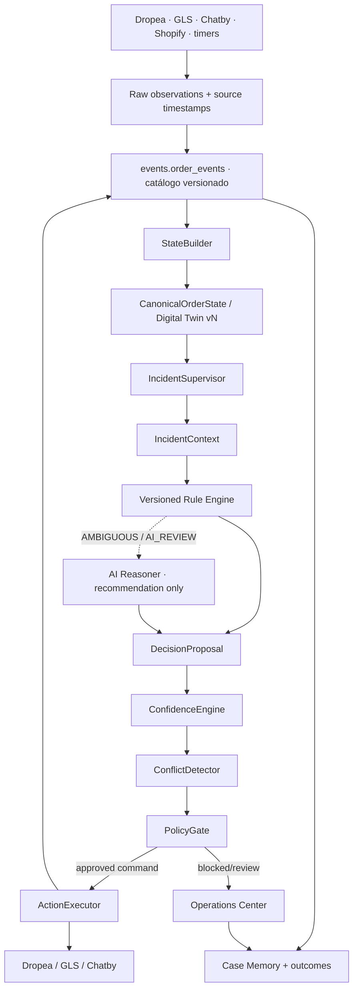

# Plan incremental de evolución de incidencias

**Estado:** propuesta de Fase 0; no implementada

**Corte:** 2026-08-19

**Modo obligatorio hasta nueva aprobación:** `SIMULATION`, `production_writes=false`

## 1. Objetivo y límites

El objetivo es convertir la plataforma existente en una cadena trazable:

```text
fuentes
  -> State Builder / Digital Twin
  -> Incident Supervisor / IncidentContext
  -> Rule Engine + AI Reasoner opcional
  -> Confidence Engine
  -> Conflict Detector
  -> Policy Gate
  -> Action Executor
  -> eventos, nuevo estado y Case Memory
```

No se crearán microservicios por cada caja. La forma recomendada es un **monolito modular en `platform-core`**, orquestado por workers Contabo y respaldado por PostgreSQL. Render continuará como legado productivo durante la comparación shadow.

Este plan no autoriza:

- cambiar reglas productivas;
- desplegar ramas de integración;
- aplicar migraciones productivas;
- enviar mensajes;
- confirmar, cancelar o modificar pedidos;
- ejecutar acciones Dropea/GLS;
- activar un modelo de IA externo.

## 2. Principios de implementación

1. **Fail-closed.** Ausencia, error, stale o unknown bloquean cualquier acción externa.
2. **Una verdad por concepto.** Un Event Store, un Digital Twin, un IncidentContext, un Rule Engine y un executor.
3. **Decidir no ejecuta.** Todos los módulos previos al executor son funciones puras o persistencia interna.
4. **Estado versionado.** Ninguna decisión se ejecuta contra una versión distinta.
5. **Política versionada.** Regla, threshold, taxonomía y capacidad deben quedar vinculados a la decisión.
6. **Evidencia temporal.** La intención más reciente y aplicable al pedido/incidencia prevalece; lo histórico no se presenta como actual.
7. **Shadow antes de writes.** Cada fase debe operar con clientes mock y después con lectura real/cero writes.
8. **Aditivo y reversible.** Migraciones expand/contract; no borrar tablas/rutas legacy durante el shadow.
9. **PII mínima.** Datos privados cifrados y fuera de MCP/read models generales.
10. **IA como recomendador.** Nunca sustituye reglas, gate ni revisión requerida; no se guarda chain-of-thought.

## 3. Fase 0.5 — Base de integración reproducible

Esta fase es previa a desarrollar componentes y no se despliega.

En paralelo, y fuera del alcance de este PR, el owner de producción debe revisar los P0 del legado activo descritos en `GAPS.md` y decidir una contención explícita. Esa decisión requiere autorización separada; el plan de arquitectura no presupone desactivar ni modificar la automatización vigente.

### Trabajo

1. Etiquetar los cortes auditados:
   - Render: `9569b01`;
   - Contabo: `e17141e`.
2. Crear una rama de integración desde `deploy@e17141e`.
3. Integrar `main@9569b01` con merge explícito y resolución por área:
   - `autoconfirm/**`: conservar como baseline la versión de `main`;
   - `apps/**`, `packages/**`, `services/**`, `migrations/**`, `infrastructure/docker/**`: conservar la plataforma Contabo salvo conflicto revisado;
   - manifests, timers, Dockerfiles y árboles `src/`: inventariar y elegir uno por runtime, no resolver por “ours/theirs” global.
4. Generar un diff de reglas productivas antes/después y exigir cero diferencia semántica.
5. Alinear Node 22.22.x, instalar MCP desde su `pnpm-lock.yaml`, declarar raíz/`autoconfirm` sin dependencias o crear sus lockfiles cuando corresponda y ejecutar todas las suites.
6. Ejecutar migraciones 001–021 desde cero y todos los rollbacks en una base efímera.
7. Corregir la trazabilidad de release en scripts/manifiestos; no tocar todavía el symlink productivo.
8. Sustituir en el entorno shadow `SUPABASE_SERVICE_ROLE_KEY` por una identidad/proxy `SELECT`-only e inventariar/reducir el scope efectivo de `CHATBY_TOKEN` antes de usar cero-write como gate.

### Aceptación

- suite `main`: 103/103 o superior;
- suite plataforma: 420/420 o superior;
- cero cambios de salida en fixtures de reglas legacy;
- migración desde cero y rollback verificados;
- imagen local y artefactos etiquetados con un SHA único;
- `production_writes_enabled=false` y `new_pipeline_production_write_count=0`, acreditados conjuntamente por credenciales read-only sin scopes mutadores, ausencia de secretos mutadores en el entorno shadow, egress mutador bloqueado, ledger local y contraste con logs autoritativos de los proveedores; no por una constante.

### Rollback

Eliminar la rama/entorno efímero. No existe rollback productivo porque no hay despliegue.

## 4. Arquitectura objetivo adaptada al repositorio



### 4.1 Contratos propuestos

Los nombres son conceptuales; deben implementarse dentro de los módulos existentes cuando sea posible.

#### `CanonicalOrderState`

Debe incluir:

- `core_order_id` UUID interno, `canonical_order_id` textual/externo, `state_version`, `schema_version`, `generated_at`;
- estado canónico e historial referenciado;
- observaciones raw por fuente con `observed_at`, `received_at`, `projected_at`;
- Chatby separado en `conversation_found`, `conversation_fresh`, `relevant_message_found`, `valid_customer_response`, `intent` y `intent_confidence`;
- incidencia vigente y mapping raw/normalized/canonical;
- timers efectivos;
- decisiones/acciones anteriores;
- `missing_fields`, `conflicts` y freshness por fuente/capa;
- hash determinista del estado.

#### `IncidentContext`

Objeto inmutable derivado de una versión exacta del twin:

- identidad del caso e incidencia, con mapeo explícito entre UUID interno e ID externo/canónico;
- qué ocurre y evidencia;
- intención actual y secuencia relevante;
- restricciones de pedido/logística/pago;
- timers activos;
- previous decisions/actions;
- candidate actions permitidas por el dominio;
- datos ausentes, conflictos y freshness;
- referencias de evidencia, nunca consultas libres desde el Decision Engine.

#### `DecisionProposal`

```json
{
  "decision_id": "uuid",
  "core_order_id": "uuid",
  "canonical_order_id": "external-text-id",
  "state_version": 18,
  "policy_version": "incident-policy-vN",
  "recommended_action": "WAIT",
  "rules_matched": [],
  "reasoning_factors": [],
  "evidence_refs": [],
  "confidence": 0.74,
  "confidence_breakdown": {},
  "requires_human_review": true
}
```

No contendrá chain-of-thought ni credenciales/PII innecesaria.

#### `AuthorizedActionCommand`

Solo lo emite Policy Gate:

- `action_id`, `decision_id`, `core_order_id` y `canonical_order_id`;
- `expected_state_version` y hashes de snapshot/política;
- acción y parámetros normalizados;
- capability concreta;
- idempotency key;
- aprobación y checks;
- expiración del comando.

## 5. Reutilización de datos antes de crear tablas

Antes de cada DDL se elaborará un mapa columna-a-columna de:

- `events.order_events`;
- relación `core.orders.id` UUID frente a `canonical_order_id` textual de los read models;
- twins y snapshots de `core`/`operations`;
- `operations.jobs` e `operations.idempotency_keys`;
- tablas de `decisions`, evidencia y comparaciones;
- `core.timers` y `operations.incident_timers`;
- `decision_memory.incident_recommendation_feedback`;
- timeline, freshness y contexto privado de migraciones 013–021.

Regla: **extender una tabla autoritativa antes de crear otra**. Si dos tablas se solapan, primero se declara autoridad y compatibilidad; su retirada solo llegará después del shadow y mediante contract migration.

Campos que deben existir en el modelo final, reutilizando los actuales cuando ya estén:

```text
schema_version
state_version
policy_version
correlation_id
causation_id
evidence_refs
input_hash
policy_hash
idempotency_key
expected_state_version
raw_response_encrypted
normalized_result
outcome
```

## 6. Catálogo de eventos

Un único catálogo compartido entre JavaScript y PostgreSQL debe incluir, como mínimo:

```text
SOURCE_OBSERVED
DIGITAL_TWIN_UPDATED
INCIDENT_CONTEXT_CREATED
DECISION_PROPOSED
RULE_MATCHED
AI_REASONING_REQUESTED
AI_RECOMMENDATION_RECEIVED
CONFLICT_DETECTED
POLICY_APPROVED
POLICY_BLOCKED
ACTION_EXECUTION_STARTED
ACTION_WOULD_EXECUTE
ACTION_SIMULATED
ACTION_REMOTE_STATE_UNKNOWN
ACTION_EXECUTED
ACTION_FAILED
ACTION_RECONCILED
HUMAN_OVERRIDE
INCIDENT_RESOLVED
CASE_MEMORY_CREATED
```

Cada evento requiere `event_id`, entidad, timestamp, source, version, payload, correlation y causation. Los nombres específicos actuales de Dropea/Chatby deben migrarse mediante aliases/versiones, no desaparecer sin replay.

## 7. Fases 1–11

### Fase 1 — State Builder + Digital Twin canónico

**Reutiliza:** `OperationsProjector`, raw mirrors, `events.order_events`, `digital-twin.mjs`, `RealityEngine`, freshness/data-quality e identity engine.

**Implementa:**

- contrato `CanonicalOrderState` versionado;
- `stream_version` monotónica asignada atómicamente por pedido, con `UNIQUE(core_order_id, stream_version)` y replay ordenado por esa versión;
- adapters de observaciones Dropea/GLS/Chatby/Shopify;
- políticas de freshness configurables;
- orden temporal y supersession;
- separación raw/canonical;
- replay desde PostgreSQL y hash determinista;
- proyección dual temporal para no romper el panel.

**No implementa:** decisión, acción ni IA.

**Aceptación:**

- 100 % de fixtures reconstruibles por replay con mismo hash, incluida ingestión concurrente sin empates ni saltos de versión;
- `FOUND/FRESH/RELEVANT/VALID` probados por separado;
- stale/unknown visibles y fail-closed;
- mapping desconocido produce `UNMAPPED`;
- cero llamadas mutadoras.

**Documentación:** `docs/incidents/architecture.md`, `digital-twin.md`.

### Fase 2 — Incident Supervisor

**Reutiliza:** `incident-simulation-sync.mjs`, `simulation-record.mjs`, `incident-processor.mjs`, identidad y read models.

**Implementa:**

- builder puro de `IncidentContext`;
- asociación exacta pedido/incidencia/conversación;
- candidate actions sin recomendación;
- timeline de evidencia y datos ausentes;
- persistencia del snapshot del contexto.

**Aceptación:** cada caso del panel puede explicar qué ocurre, qué hizo el cliente, qué falta y qué restricciones existen sin consultar conectores durante la decisión.

### Fase 3 — Decision Engine híbrido

**Reutiliza:** `DeterministicDecisionEngine`, políticas de incidencia vigentes y fixtures legacy.

**Implementa primero:** Rule Engine central, puro, versionado y explicable. Las contradicciones C-01–C-09 permanecen bloqueadas o en human review hasta que operaciones apruebe una política.

**AI Reasoner opcional:**

- interfaz desacoplada y deshabilitada por defecto;
- invocación solo si el Rule Engine devuelve `AMBIGUOUS/AI_REVIEW`;
- output JSON validado y limitado a recomendación/intención/factores/confianza declarada;
- timeout/error/invalid output -> revisión humana;
- prompt/eval versionados y contenido no fiable delimitado;
- redacción/tokenización previa y allowlist de campos; ninguna PII se envía por defecto;
- evaluación previa de proveedor, residencia, retención, uso/no-entrenamiento, base jurídica y DPIA cuando aplique;
- ninguna herramienta ni capacidad de egress;
- no activación de proveedor externo sin aprobación separada.

**Aceptación:** casos deterministas no llaman al reasoner; mismos inputs+versiones producen misma salida; toda propuesta referencia reglas y evidencia.

**Documentación:** `decision-engine.md`.

### Fase 4 — Confidence Engine

Implementar una función pura configurada por política, no porcentajes dispersos. Componentes iniciales:

- fuerza de regla;
- calidad/completitud;
- freshness;
- confianza de intención;
- soporte histórico elegible;
- penalización por conflicto/missing data;
- calidad del mapping.

La suma debe normalizarse y guardar breakdown, pesos y versión. La confianza declarada por IA es una entrada limitada, nunca el resultado final.

Política inicial solicitada:

| Confianza | Tratamiento inicial |
|---|---|
| `>=0.95` | Candidata a autoejecución solo si riesgo, freshness y Policy Gate lo permiten |
| `0.80–0.949` | Solo acciones realmente seguras/reversibles; en shadow no ejecuta |
| `0.60–0.799` | Revisión humana |
| `<0.60` | Bloqueada/revisión obligatoria |

Los thresholds estarán en una única política versionada. La calibración se medirá contra outcomes; no se promocionará por volumen o por alcanzar artificialmente 80–90 %.

### Fase 5 — Conflict Detector

**Reutiliza:** `conflict-resolver.mjs`, `RealityEngine`, contradicciones del twin y reconciliation.

Detectará, al menos:

- mensaje/intención posterior;
- cambio Dropea/GLS;
- timer vencido o superseded;
- acción previa incompatible/duplicada;
- stale/unknown;
- incidencia cerrada;
- pedido entregado;
- devolución iniciada;
- confirmación/cancelación posterior;
- versión de estado distinta.

Todo conflicto tiene código, severidad, blocking, evidencia y timestamp. Justo antes del executor se reconstruye/revalida el twin; cambio de versión produce `RE_EVALUATE`.

**Documentación:** `conflict-detector.md`.

### Fase 6 — Policy Gate

**Reutiliza:** `authorization.mjs`, `governance-engine.mjs`, Risk, QA, Compliance, policy registry/lifecycle y operational protections.

Checks mínimos:

- mode/capability;
- acción permitida y clasificación de riesgo;
- política/version aplicable;
- confidence mínima;
- freshness/calidad/mapping;
- ausencia de conflictos bloqueantes;
- incidencia activa/pedido modificable;
- snapshot vigente;
- timer efectivo;
- no duplicidad/idempotencia;
- límites operativos y, cuando corresponda, aprobación humana.

Un fallo crítico devuelve `BLOCKED`; el gate nunca “arregla” datos ni ejecuta.

**Documentación:** `policy-gate.md`.

### Fase 7 — Action Executor idempotente, aislado y todavía en simulación

**Reutiliza:** tablas de jobs/idempotencia/DLQ/locks, adaptadores V2, claims Chatby y ledger/audit existentes.

Orden obligatorio:

1. reservar idempotency key en transacción;
2. cargar comando y aprobación;
3. reconstruir estado actual;
4. comparar versión/hash;
5. reejecutar checks críticos de Policy Gate;
6. verificar mode y capability;
7. registrar intento;
8. en simulación, persistir `WOULD_EXECUTE` sin egress;
9. contra un servidor fake, simular éxito, fallo y commit remoto ambiguo;
10. guardar respuesta raw cifrada y resultado normalizado;
11. reconciliar el estado del fake;
12. emitir eventos y regenerar twin.

No se habilitará producción ni se desplegará un contenedor con credenciales mutadoras en esta fase. Se implementarán fault injection, egress deny, timeout ambiguo, crash/restart y concurrencia. La rama de egress real solo podrá añadirse/promoverse tras Fase 11 en un cambio separado, revisado por capability.

**Documentación:** `action-executor.md`.

### Fase 8 — Case Memory + Human Feedback

**Reutiliza:** migración 020 y decision memory.

Primero se declarará la autoridad y el vínculo entre `decision_memory.records` —que ya posee columnas `executed_decision`/`final_outcome` pero no tiene consumidor runtime— e `incident_recommendation_feedback` de la migración 020 —que no guarda acción/outcome—. Solo después se extenderá el modelo, sin duplicar columnas equivalentes, para guardar:

- snapshot y recomendación original;
- decisión/override humano, motivo, actor y fecha;
- acción efectuada o simulada;
- outcome final y fecha;
- confidence/breakdown;
- versiones de regla/política;
- calidad del caso para entrenamiento/evaluación.

Soporte histórico inicial con PostgreSQL y campos categóricos/JSONB; no introducir vector DB. Una consulta de casos similares puede aportar `historical_support`, pero jamás ejecutar por sí sola. Feedback no se convierte automáticamente en regla: requiere revisión, test, versión y aprobación.

**Documentación:** `case-memory.md`.

### Fase 9 — Operations Center orientado a excepciones

El frontend no calculará decisiones. Consumirá read models canónicos para cinco vistas:

1. **Incidencias:** pedido, tipo, carrier status, intención, edad, decisión, confidence, automation status, timer, última respuesta y freshness.
2. **Revisión humana:** propuesta, factores, evidencia, conflicto y acciones approve/override/contact gobernadas.
3. **Bloqueados:** código, fuente, motivo, timestamp, decisión y acción bloqueada.
4. **Decisiones automáticas:** en shadow mostrará `WOULD_EXECUTE`; en el futuro, acciones aprobadas y outcomes.
5. **Calidad:** auto-resolution, human review, policy block, conflict, override, outcome, tiempo y calibración.

La PII se obtiene solo por API autenticada con scope/finalidad/auditoría; MCP sigue enmascarado. Timeline causal unifica observación, twin, contexto, decisión, gate, simulación/acción y outcome.

**Documentación:** `operations-center.md`.

### Fase 10 — Shadow mode legacy vs new

**Reutiliza:** parity engine, reconciliation ledger/worker, readiness engine, three-way comparator y tablas de simulation comparisons.

Por cada caso elegible:

```json
{
  "legacy_decision": "WAIT",
  "new_decision": "RETRY_DELIVERY",
  "difference": true,
  "difference_type": "RULE_POLICY",
  "legacy_evidence_hash": "...",
  "new_snapshot_hash": "...",
  "new_pipeline_production_write_count": 0
}
```

Guardar también casos donde el legacy actuó y su resultado remoto, sin permitir que el motor nuevo actúe.

#### Criterios mínimos de salida

- denominador definido como todos los casos observados que cumplan un contrato de datos prepublicado; exclusiones limitadas, contadas y clasificadas;
- >=99 % de casos elegibles comparados y >=99 % del total observado explicado por comparación o exclusión justificada;
- 100 % de casos de alto riesgo comparados o bloqueados con causa explícita;
- ventana, tamaño mínimo y segmentos por tipo de incidencia/riesgo aprobados antes de mirar resultados;
- 100 % de diferencias clasificadas con owner;
- acuerdo >=99 % en reglas declaradas deterministas;
- cero falsos positivos peligrosos con adjudicación humana independiente y límites de confianza reportados;
- evaluación contra ground truth/outcome revisado, no solo contra un legado con errores conocidos;
- cero egress mutador del nuevo pipeline, verificado por credenciales read-only, ausencia de secretos mutadores, egress deny, ledger y logs autoritativos del proveedor;
- fuentes frescas o caso excluido/bloqueado explícitamente;
- ventana temporal representativa acordada por operaciones;
- métricas de calibración y overrides disponibles.

El porcentaje objetivo de automatización es una consecuencia, no un gate de seguridad.

**Documentación:** `testing.md`, `rollout.md`.

### Fase 11 — Informe de preparación productiva

Emitir un go/no-go que incluya:

- arquitectura y SHA exactos;
- migraciones y rollback probados;
- reglas reutilizadas y contradicciones resueltas por owner;
- tests/evals/fault injection;
- comparación legacy/new;
- calibración por tipo y riesgo;
- PII/auditoría/backup/restore;
- SLOs y alertas;
- capabilities candidatas y blast radius;
- plan canary y kill switch;
- riesgos pendientes.

Incluso con `GO`, la primera promoción requerirá autorización humana separada, por capability y con canary. No habrá cambio automático de modo.

## 8. Modelo global de modo y capacidades

El modo se valida una vez en el composition root y se propaga como objeto inmutable:

```json
{
  "mode": "SIMULATION",
  "production_writes": false,
  "capabilities": [],
  "policy_version": "...",
  "release_sha": "..."
}
```

Reglas:

- `SIMULATION` y `READ_ONLY` exigen lista de capabilities mutadoras vacía y egress deny;
- `PRODUCTION` exige `production_writes=true`, release allowlisted y capabilities concretas;
- una capability no habilita otra (`ORDER_CONFIRM` no habilita `ORDER_CANCEL`);
- cambios de modo/capability generan evento de auditoría y requieren rollout explícito;
- el entorno shadow no almacena credenciales con scopes mutadores y usa cuentas técnicamente read-only;
- cualquier inconsistencia impide el arranque.

## 9. Taxonomía de efectos y riesgo

No basta con “reversible/irreversible”. Se propone una política configurable:

| Clase | Ejemplos conceptuales | Tratamiento inicial |
|---|---|---|
| `NO_EXTERNAL_EFFECT` | `WAIT`, `REVIEW`, propuesta interna | Puede automatizarse en simulación |
| `REVERSIBLE_INTERNAL` | etiqueta/estado interno reversible | Gate, idempotencia y auditoría |
| `EXTERNAL_COMMUNICATION` | contactar/enviar mensaje | No puede des-enviarse; revisión/capability propia |
| `PARTIALLY_REVERSIBLE_LOGISTICS` | reintento, cambio de ventana | Confidence alta, estado fresco y política específica |
| `IRREVERSIBLE_HIGH_RISK` | devolución, cancelación, confirmación | Umbral máximo, gate completo y aprobación/canary inicial |
| `UNKNOWN_EFFECT` | acción no catalogada | Siempre bloqueada |

La clasificación exacta de cada acción exige aprobación operativa. Hasta entonces `UNKNOWN_EFFECT` es el default.

## 10. Estrategia de tests y evals

### 10.1 Unitarios

- normalización/freshness/state builder;
- mappings y `UNMAPPED`;
- IncidentContext;
- reglas y precedencia temporal;
- confidence/breakdown;
- conflictos;
- Policy Gate;
- timers/transiciones;
- idempotency state machine;
- masking/cifrado/scopes.

### 10.2 Integración con mocks

- Dropea, GLS, Chatby y Shopify;
- PostgreSQL real efímero y migraciones desde cero;
- replay y projector;
- executor con servidor remoto fake;
- timeouts antes/después de commit;
- crash/restart y reconciliación;
- concurrencia multiproceso;
- egress deny en modos no productivos.

### 10.3 Escenarios de decisión

Los seis escenarios mínimos solicitados se conservarán como fixtures de aceptación:

| Caso | Entrada esencial | Resultado esperado |
|---|---|---|
| 1 | `RECIPIENT_ABSENT`, cliente quiere recibir, retry disponible | `RETRY_DELIVERY`, confidence alta |
| 2 | `NO_ACCEPTA`, cliente indica “devolver” | `RETURN_TO_ORIGIN` como propuesta; ejecución sujeta a gate/modo |
| 3 | Cliente cancela y después afirma que sí quiere | `CONFLICT`, cero ejecución |
| 4 | Decisión sobre state v15, estado actual v16 | `RE_EVALUATE` |
| 5 | Código GLS desconocido | `UNMAPPED`, autoejecución bloqueada |
| 6 | Conversación encontrada, último mensaje válido antiguo | `FOUND=true`, `FRESH=false`, `VALID_RESPONSE=false` |

Se añadirán, como mínimo, estos escenarios:

- dirección anterior + cancelación posterior -> conflicto/bloqueo;
- cancelación anterior + aceptación posterior -> conflicto, cero ejecución y revisión/re-evaluación;
- mensaje de otro pedido -> ignorado;
- conversación encontrada pero stale -> no valid response;
- entrega ya completada -> acción bloqueada;
- devolución ya iniciada -> no duplicar;
- timer activo reemplazado por respuesta -> `SUPERSEDED`;
- timer vencido consumido dos veces -> una transición;
- incidencia histórica y otra vigente -> solo la vigente;
- Chatby HTTP error / no hilo / hilo sin relevante -> estados distintos;
- pago `unpaid`/`partially_paid` -> no pagado;
- mapping carrier desconocido -> bloqueado;
- policy cambia entre decisión y ejecución -> re-evaluate;
- respuesta remota ambigua -> `REMOTE_UNKNOWN`, sin retry ciego;
- 100 ejecuciones concurrentes -> una consecuencia remota;
- feedback humano sin outcome -> no aporta soporte histórico;
- prompt injection en mensaje cliente -> contenido tratado como datos no confiables.

### 10.4 Calidad mínima

- CI Node 22;
- cobertura >=90 % en decisión, conflict, policy, executor e idempotencia;
- mutation/property tests en precedencia temporal y gates;
- test de carga del worker/read models;
- eval dataset versionado, anonimizado y estratificado por tipo/riesgo;
- cero secretos o PII en fixtures/logs.

### 10.5 Confianza de entradas e IAM en tests

- webhooks con firma válida/inválida, timestamp antiguo, replay, tenant erróneo, payload inválido y body sobredimensionado;
- RBAC por capability, least privilege y denegación cross-tenant;
- MFA/reautenticación para acciones de alto riesgo;
- segregación proponente/aprobador y aprobación firmada contra snapshot/policy hash;
- kill switch/circuit breaker con SLO de propagación y drill;
- ausencia de secretos mutadores y consulta de logs de proveedor para demostrar cero writes.

## 11. Métricas, SLOs y alertas

### Contadores solicitados

```text
incident_total
incident_active
incident_resolved
decision_total
decision_auto
decision_human
decision_blocked
policy_approved
policy_blocked
conflict_detected
human_override
action_success
action_failed
case_memory_count
```

### Métricas adicionales necesarias

```text
source_lag_seconds{source}
twin_age_seconds
decision_latency_seconds
decision_re_evaluated_total
action_remote_unknown_total
reconciliation_lag_seconds
shadow_comparison_coverage
shadow_dangerous_diff_total
pii_decrypt_total{purpose}
production_write_total{capability}
```

Derivadas: auto-resolution, override, policy-block, decision-success, mean resolution time, calibration error y Brier score. Alertas críticas ante write en modo no productivo, fuente stale en comando, estado remoto ambiguo, diff peligroso, fallo de auditoría o release SHA incoherente.

## 12. Privacidad, auditoría y recuperación

Antes de exponer Case Memory o timeline:

- scope `operations:pii:read` y propósito obligatorio;
- evento durable por descifrado;
- claves HMAC/cifrado separadas, `key_id` y rotación;
- raw response cifrada y redacción en logs;
- retención/borrado aprobados, propagación a read models/backups y mecanismo de tombstone o crypto-erasure para no conservar PII dentro del payload append-only;
- gate de minimización antes de cualquier Reasoner externo y requisitos de residencia/retención/no-training/DPIA;
- auditoría append-only con correlation/causation, sellado/tamper evidence, rol y almacenamiento independientes y reloj sincronizado;
- backup cifrado offsite;
- RPO <=24 h y RTO <=60 min;
- restore drill mensual;
- rollback por imagen/release inmutable, no por overlay de archivos.

La cadena de suministro exige dependencias fijadas, SBOM, SCA/CVE, artefacto firmado y attestation de procedencia. Las acciones irreversibles requieren RBAC por capability, MFA/reautenticación, separación entre proponente y aprobador y aprobación inmutable ligada al snapshot.

## 13. Estrategia de rollout futura

```text
local mocks
  -> integration DB
  -> shadow con fixtures
  -> shadow con lecturas reales y egress deny
  -> ventana legacy/new
  -> informe Fase 11
  -> capability canary explícitamente aprobada
  -> expansión gradual o rollback
```

El primer canary, si llega a aprobarse, debe limitar tienda/tipo/acción/volumen, exigir kill switch, circuit breaker, owner on-call, runbook para escritura errónea/`REMOTE_UNKNOWN`, tiempo máximo de propagación probado y observación humana. Acciones irreversibles no serán la primera capability productiva.

## 14. Entregables por fase

| Fase | Código/migración | Documento/evidencia |
|---|---|---|
| 0 | Ninguno | `CURRENT_ARCHITECTURE.md`, `GAPS.md`, `IMPLEMENTATION_PLAN.md` |
| 0.5 | Rama de integración no desplegada | diff de reglas, baseline Node 22, migración/rollback |
| 1 | State Builder/twin | `architecture.md`, `digital-twin.md`, replay hashes |
| 2 | Incident Supervisor | contrato/context fixtures |
| 3 | Rule Engine/reasoner interface | `decision-engine.md`, evals |
| 4 | Confidence Engine | calibración inicial |
| 5 | Conflict Detector | `conflict-detector.md` |
| 6 | Policy Gate | `policy-gate.md` |
| 7 | Executor simulation-only | `action-executor.md`, fault injection |
| 8 | Case Memory/feedback | `case-memory.md` |
| 9 | Operations views | `operations-center.md` |
| 10 | Shadow comparator | `testing.md`, `rollout.md`, informe de diffs |
| 11 | Ninguno automático | informe go/no-go y autorización pendiente |

## 15. Estado al cerrar Fase 0

```text
architecture implemented: no (audit and plan only)
files modified outside docs/incidents: 0
migrations performed: 0
new tables: 0
new services: 0
simulated customer actions: 0
production writes initiated by this audit: 0
real customer messages initiated by this audit: 0
real Dropea actions initiated by this audit: 0
real GLS actions initiated by this audit: 0
```

Siguiente paso recomendado: revisar y aprobar este diagnóstico; después ejecutar únicamente la Fase 0.5 en una rama no desplegada.

## 16. Glosario operativo

| Término | Uso en este plan |
|---|---|
| `shadow` | Ejecución paralela de lectura/simulación sin efectos externos |
| `egress` | Tráfico saliente capaz de invocar un sistema externo |
| `freshness` | Vigencia temporal acreditada de una fuente o proyección |
| `outcome` | Resultado final observado después de una decisión/acción |
| `owner` | Responsable nominal de aceptar, corregir o escalar un riesgo |
| `capability` | Permiso técnico granular para una clase concreta de acción |
| `ground truth` | Resultado validado por evidencia autoritativa o adjudicación humana |
