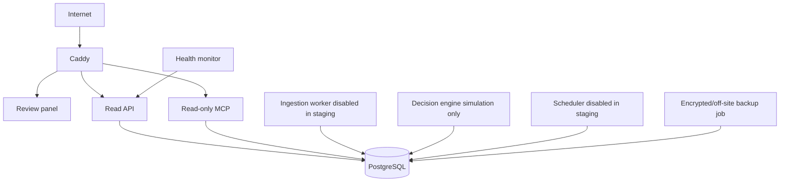

# VPS target architecture

## Containers

- `reverse-proxy`: TLS termination, routing and security headers.
- `review-panel`: static review interface.
- `api`: health and future read-only panel endpoints.
- `mcp-server`: Streamable HTTP MCP with bearer authentication.
- `decision-engine`: deterministic simulation process.
- `ingestion-worker`: present but live connectors disabled.
- `scheduler`: present but live cron disabled.
- `postgres`: the only stateful application dependency.
- `backup`: on-demand maintenance profile.
- `monitoring`: internal availability checks.

## Networks

- `public_network`: reverse proxy only.
- `application_network`: internal HTTP between proxy and services.
- `database_network`: PostgreSQL clients only.
- PostgreSQL has no host port.

## Minimum proposed size

- 4 vCPU.
- 8 GB RAM.
- 75 to 80 GB NVMe.
- EU region.
- Daily provider snapshot plus independent encrypted database backup.

This is sufficient for staging and initial production at current scale, subject to load testing.
